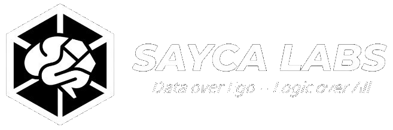
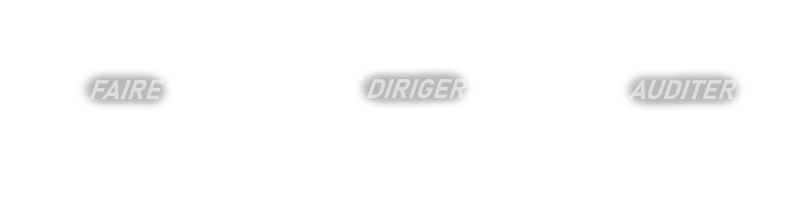

  

  

## Infrastructures IA Souveraines & Systèmes B2B Modulaires

**Fondateur du Sayca Labs** - Label solo et freelance de logiciels et d'infra

---

🛠️ Compétences en dev (Tech Stack)

| Domaine | Technologies | Objectif |
| :--- | :--- | :--- |
| **Bas Niveau** | `C`, `Unix`, `Shell` | Maîtriser la vérité matérielle pour ne jamais subir l'abstraction. |
| **Systèmes Autonomes** | `Python`, `LLM (RAG)`, `APIs` | L'automatisation au service de l'efficacité métier. |
| **Infrastructure** | `Docker`, `Linux`, `Git` | Des environnements isolés, sécurisés et souverains. |
| **Génie Logiciel** | `Modularité`, `Clean Code` | Protocoles d'users-to-LLM pour la facilité de haut-niveau pour utilisateurs non-techniques. |

---

  
🚀 Rôle et résultats de mon travail

  
Je ne vends pas de "gadgets". Ma mission est de bâtir l'infrastructure invisible qui transforme les processus manuels coûteux en **marge nette**. Mon approche fusionne la rigueur du **bas-niveau (C)** avec la puissance des **systèmes autonomes (Python/IA)** pour garantir des solutions robustes, auditables et souveraines.

* **Souveraineté :** Vos données restent sous votre contrôle, hors des clouds publics.
* **Performance :** Optimisation bas-niveau pour traiter des volumes massifs avec efficacité.
* **ROI :** Automatisation critique des flux administratifs et logistiques.

---

  
📂 Projets actuels

  
* **[Projet C/42]** : *Projets académiques (42) sous licence privée conformément à la charte de l'école. Focus : Réimplémentation de bibliothèques standards (Libft), systèmes de fichiers et gestion mémoire. -> [Voir mes autres dépôts github](https://github.com/devSayca?tab=repositories)*
* **[Smartphone Bridge Unit]** : *Déploiement de terminaux de diagnostic terrain, interfaçage bas-niveau avec automates industriels et monitoring de flux de données sécurisés via Shizuku/Termux.*
* **[Triadic Intelligence]** : *Protocole formant les utilisateurs à un usage "bicéphale" des intelligences artificielles génératives et agentiques.*
* **[Sailor Energy]** : *Optimisation de flux agentiques et logistiques via systèmes autonomes appliqués à la régie publicitaire physique.*

---

  
📊 Progression & Engagement

* **Ingénierie Système & IA :** Optimisation de la performance concurrente (`Threads`, `Mutex`) pour architectures distribuées et déploiement du protocole MCP. Spécialisation dans l'interfaçage hybride (Performance C / Flexibilité Python).
* **Leadership Technique :** Ambassadeur à l'École **42 Nice**. Expertise en résolution de problèmes critiques en environnement collaboratif (Peer-Learning) et agilité face aux ruptures technologiques.

---

  
🎯 Roadmap & Écosystème

### 📈 Objectifs Stratégiques
* **⚡ Immersion Technique (Stage 42) :** Recherche d'un environnement à haute exigence (Systèmes distribués, Kernel, R&D Agentique) pour **Début 2027**. Focus : Architectures résilientes et optimisation de bas-niveau.
* **🤝 Expertise B2B :** Support technique et conseil pour structures souhaitant migrer vers des **flux autonomes souverains**. Intervention sur l'automatisation de processus critiques sans dépendance cloud.
* **🚀 Sayca Labs :** Incubation de protocoles d'interfaçage IA/Bas-Niveau et déploiement de solutions modulaires propriétaires.

### ⚙️ Méthodologie de travail
* **Design-Driven Development :** Spécification d'architecture systématique avant production. La documentation est traitée comme un actif technique vital.
* **Audit-Ready Codebase :** Modularité et commentaires aux standards industriels pour une transparence totale et une passation sans friction.
* **Unix-Centric Robustness :** Application du principe de responsabilité unique. Priorité absolue à la stabilité systémique et à la réduction de la surface d'attaque.

---

  
🌐 Stack de Veille & R&D

* **Architectures Agentiques :** Analyse des paradigmes de planification (ReAct, Reflexion) et orchestration de flux multi-agents via le protocole **MCP**.
* **Optimisation de l'Inférence :** Veille sur les techniques de quantification (GGUF, EXL2) et l'exécution locale de modèles **MoE (Mixture of Experts)** pour la souveraineté.
* **Standards Systèmes :** Étude des RFC liées aux communications inter-processus (IPC) haute performance et à la sécurité mémoire en environnement C/Unix.
* **IA Neuro-Symbolique :** Recherche sur l'hybridation entre raisonnement logique formel et modèles de langage pour garantir la fiabilité des décisions IA.

---

### 📬 Connexion & Réseau

* 💼 **[Me contacter sur LinkedIn](https://linkedin.com/in/sayca)** — *Stratégie B2B & Partenariats*
* 🧠 **Instagram :** [@sayca.labs](https://instagram.com/sayca.labs) — *Coulisses techniques & Entreprise informatique*
* **42 Nice :** <https://42nice.fr>
---

### 📜 Manifeste

1.  **L'Humain pilote :** La machine exécute, l'humain supervise.
2.  **Souveraineté réelle :** L'utilisateur doit posséder et comprendre ses outils.
3.  **Durabilité :** Développer des architectures faites pour durer et subir des transformations (traductions, transpositions) liées aux cycles de péremption logiciels.

