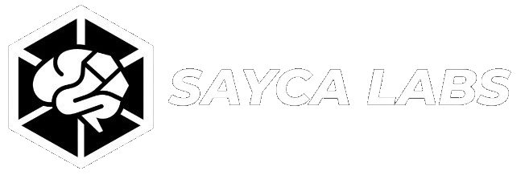

 

  

💼 **[LinkedIn](https://linkedin.com/in/sayca)**
🎓 **[42 Nice](https://42nice.fr/)**
🧪 **[Sayca Labs](https://saycalabs.com/)**

---

### 🛠️ Compétences brutes

| Domaine | Technologies | Objectif |
| :--- | :--- | :--- |
| **Bas Niveau** | `C`, `Unix`, `Shell` | Maîtriser la vérité matérielle pour ne jamais subir l'abstraction. |
| **Systèmes Autonomes** | `Python`, `LLM (RAG)`, `APIs` | L'automatisation au service de l'efficacité métier. |
| **Infrastructure** | `Docker`, `Linux`, `Git` | Des environnements isolés, sécurisés et souverains. |
| **Génie Logiciel** | `Modularité`, `Clean Code` | Protocoles d'users-to-LLM pour la facilité de haut-niveau pour utilisateurs non-techniques. |

---

  
💎 Avancement Tech Lead & R&D

​(2021-2025) ✅ - Fondations en Architecture de l'Information

* ​Recherche personnelle sur les ontologies logiques et la structuration des données complexes.

​* Analyse systémique des infrastructures de données héritées (Legacy) et des flux d'informations distribués.

* ​Conceptualisation du protocole Sayca Labs : Souveraineté et Performance.

​(2025-2027) ⏳ - Ingénierie Système & Vérité Logicielle (42next)

* ​Immersion Bas-Niveau (C23) : Maîtrise de la gestion mémoire, des processus et de l'interfaçage système pur.

* ​Algorithmie avancée : Optimisation de structures de données pour des charges de travail critiques.

* ​Développement de bibliothèques propriétaires (comme la fusion de 42 et SaycaLabs par libft_axiom) visant l'équilibre entre abstraction et performance métal.

​(2027-2030) 🔒 - Expérience Industrielle & Hyperscale (RNCP 6/7)

* ​Déploiement d'architectures résilientes en environnement B2B à haute exigence.

* ​Spécialisation dans les systèmes distribués et le clustering souverain (Zéro-Cloud).

* ​Certification d'Expert en Architecture Systémique et Sécurité des Flux.

​(Post 2031) 🔒 - Recherche Doctorale : Systèmes de Synthèse Augmentés

* ​Transfert vers un Master de Recherche pour engager des travaux de Doctorat, parallèle aux activités industrielles.

* ​Sujet visé : Hybridation entre raisonnement symbolique (N+1/N+2) et modèles de langage agentiques (Synthétiques).

* ​Objectif : Habilitation à Diriger les Recherches (HDR) pour définir les nouveaux standards de l'Intelligence Augmentée.

---

  
🚀 Mon rôle // Valeur ajoutée

  
Ma mission est de bâtir des infrastructures hyperscales. Mon approche fusionne la rigueur du **bas-niveau (C)** avec la puissance des **systèmes autonomes (Python & IAs de ruches)** pour garantir des solutions robustes, auditables et souveraines.

### S / P / ROI
* **Souveraineté :** Les données restent sous notre contrôle local et cyber, hors des clouds publics.
* **Performance :** Optimisation bas-niveau pour traiter des volumes massifs avec efficacité.
* **ROI :** Automatisation des flux critiques en administratif et en logistique.

---

  
📂 Projets en cours

  
* **[42 Nice - C/Python]** : *Projets académiques (42) sous licence privée conformément à la charte de l'école. Focus : Réimplémentation de bibliothèques standards (Libft), systèmes de fichiers et gestion mémoire. -> [Voir mes autres dépôts github](https://github.com/devSayca?tab=repositories)*

* **[SAYCA LABS - OMISHELL]** : *Terminaux de diagnostic terrain, détection système universelle par interfaçage bas-niveau pour lectures et injections, gestion critique des systèmes classés interdits, et monitoring de flux de données sécurisés via Shizuku/Termux.*

* **[SAYCA LABS - Triadic Intelligence]** : *Protocole primitif pour les premières années de collaboration Homme-IA, pour un usage "bicéphale" des intelligences artificielles génératives et agentiques.*

* **[SAYCA LABS - Sailor Energy]** : *Projet complété et terminé. Optimisation de flux agentiques et logistiques via systèmes autonomes appliqués à la régie publicitaire physique.*

---

  
⚙️ Méthodologie de travail

* **Design-Driven Development :** Spécification d'architecture systématique avant production. La documentation est traitée comme un actif technique vital.

* **Audit-Ready Codebase :** Modularité et commentaires aux standards industriels pour une transparence totale et une passation sans friction.

* **Unix-Centric Robustness :** Application du principe de responsabilité unique. Priorité absolue à la stabilité systémique et à la réduction de la surface d'attaque.

---

  
🌐 Stack de Veille & R&D

* **Architectures Agentiques :** Analyse des paradigmes de planification (ReAct, Reflexion) et orchestration de flux multi-agents via le protocole **MCP**.

* **Optimisation de l'Inférence :** Veille sur les techniques de quantification (GGUF, EXL2) et l'exécution locale de modèles **MoE (Mixture of Experts)** pour la souveraineté.

* **Standards Systèmes :** Étude des RFC liées aux communications inter-processus (IPC) haute performance et à la sécurité mémoire en environnement C/Unix.

* **IA Neuro-Symbolique :** Recherche sur l'hybridation entre raisonnement logique formel et modèles de langage pour garantir la fiabilité des décisions IA.

---

#### Rappel :
#### L'Intelligence Artificielle Moderne n'est pas un effet de mode, c'est l'évolution logique de la stack informatique qui arrive bien avant les Super-Intelligences.

  

